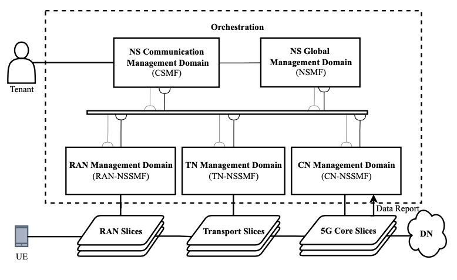

# Network Slice as a Service Platform (NASP)

This reposittory describes steps for installing the elements that make up NASP (Network Slice as a Service Platform). The instalation process involves at least 3 different machines as a Kubernetes Cluster.


### Kubernetes Cluster

* Digital Ocean 
* Elastic Kubernetes Service (AWS)
* Local (Kubespray)

The steps described in this repository were performed based on a system architecture similar to the one shown in the figure below:

<p align="center">
     
</p>


## Observability on K8s components installation

The installation steps for each of the 3 components are described below. 
**Attention: All installation steps described below must be performed with root privileges (SUDO SU).**

#### 1º Kubernetes Cluster Configuration

Access via terminal a machine who has access to Kubernetes Cluster CTL. 
Check Kubernetes version:

```
sudo kubectl --version
```

Install Observability Helm Charts:

```
helm repo add grafana https://grafana.github.io/helm-charts
helm create ns grafana
helm install grafana -n grafana
```

Install Loki:

```
helm repo add loki https://grafana.github.io/helm-charts
helm create ns loki
helm install loki -n grafana
```

Install Linkerd:

```
# To add the repo for Linkerd stable releases:
helm repo add linkerd https://helm.linkerd.io/stable

# To add the repo for Linkerd edge releases:
helm repo add linkerd-edge https://helm.linkerd.io/edge

helm install linkerd-crds linkerd/linkerd-crds \
  -n linkerd --create-namespace
  
helm install linkerd-control-plane \
  -n linkerd \
  --set-file identityTrustAnchorsPEM=ca.crt \
  --set-file identity.issuer.tls.crtPEM=issuer.crt \
  --set-file identity.issuer.tls.keyPEM=issuer.key \
  linkerd/linkerd-control-plane
```


To check services availabity, check:

```
kubectl get pods -A
```

And the expected output should be like this:


#### Installing NASP to run Locally and connect to remote Cluster

Install python3, pip and poetry:

```
sudo apt install -y python3 python3-pip poetry
```

Clone this repository:

```
git clone https://github.com/fhgrings/NASP.git
```

Access NASP Python application:

```
cd NASP/nasp
```

Install and Update python packages:

```
poetry install --all
```

Run the following command to execute NASP Application with poetry environment:

```
poetry run flask run --debug
```

**Then, access it from your browser:**

http://localhost:5000/nasp

#### 2º Load Data to the application

Download the example infrastructure require from the repository:

https://github.com/fhgrings/NASP/tree/main/helm_charts

Open the main *values.yaml* on Helm repo root directory

Update input values from required on infrastructure choosen and save the file:

```yaml
global:
  name: free5gc
  userPlaneArchitecture: single  # possible values are "single" and "ulcl"
  nrf:
    service:
      name: nrf-nnrf
      type: ClusterIP
      port: "8000"
      nodePort: "30800"
    nodeSelector:
      ##kubernetes.io/hostname: worker2
  sbi:
    scheme: http
  amf:
    service:
      name: amf-n2
      port: 38412
      targetport: 31412
      protocol: SCTP
      type: NodePort
      n2:
```

Compress the entire folder

Upload the ZIP file to http://localhost:5000/nsst using the **Add Subnet Slice Template** button:


### Run UE-non3GPP
After adjusting all the configuration parameters, registering the UE in free5GC with the same parameters used in the configuration file and making sure that 5GC and N3IWF are running, execute the following command:

```
go run cmd/main.go ue
```
After execution, open another terminal on the same machine and check if a new network interface (eg gretun1) has been created.

### Testing how UE-non3GPP works
To test the operation of UE-non3GPP run the command below:
```
ping -I gretun1 8.8.8.8
```
The above command triggers a connection (ping) to google. If everything is in perfect working order, the terminator must present a positive response to the request. This means that you can direct network traffic to the `gretun1` interface and data network access via 5GC will perform satisfactorily.


## Troubleshooting

### 5GC

#### Network Functions Conflict 

The 5GC network functions are initialized through a `` ./run.sh ``. If, eventually, the connection with the terminal that initialized the .sh is closed improperly, the functions will continue running as loose processes on the execution stack. When trying to initialize the 5GC again, errors related to connection ports that are already in use will be triggered.
To solve the problem, just run `` ./force_kill.sh ``, is located in the same directory as the ``run.sh`` script. When executing  `` ./force_kill.sh `` all active processes related to the execution of the 5GC functions will be terminated and a new execution can be performed.

#### Conflict in the execution of 5GC API server

For a UE to be able to use the 5GC functionalities, it must be duly registered in the database. This record is performed through a [Rest API](https://github.com/LABORA-INF-UFG/Proto6G-Install#initializing-the-5gc-api-server) provided by the 5GC.
If eventually the terminal used to initialize the API is closed improperly, port 5000 will remain in use, preventing a new execution. In this case, the process must be terminated using kill -9 as described below:

* Find the PID of the process that is using port 50000: ``sudo netstat -nlp | grep :5000``
* Kill the process through the PID:: ``kill -9 <<PID-Nº>>``

#### Data inconsistency in 5GC MongoDB

In experimental scenarios, where the UE-non3GPP + 5GC connection procedures are repeated several times, it may happen that MongoDB persists inconsistent information. In these cases, it is interesting to delete the database and register the UEs again. To resolve the issue, perform the following steps:

* Terminate the execution of UE-non3GPP, N3IWF and 5GC.
* Access through a new terminal on the machine where 5GC was installed.
* Type in terminal `` mongo ``  to connect MongoDB CLI.
* In MongoDB CLI type `` use free5gc `` to connect to free5gc base.
* Type `` db.dropDatabase() `` to completely delete the 5gc database.

After deleting the database, [initialize 5GC](https://github.com/LABORA-INF-UFG/Proto6G-Install#initializing-the-5gc-functions), [initialize API Server](https://github.com/LABORA-INF-UFG/Proto6G-Install#initializing-the-5gc-api-server), [initialize N3IWF](https://github.com/LABORA-INF-UFG/Proto6G-Install#start-n3iwf), [register UE-non3GPP](https://github.com/LABORA-INF-UFG/Proto6G-Install#register-ue-non3gpp-into-5gc) and [test Proto6G components](https://github.com/LABORA-INF-UFG/Proto6G-Install#testing-proto6g-components).
