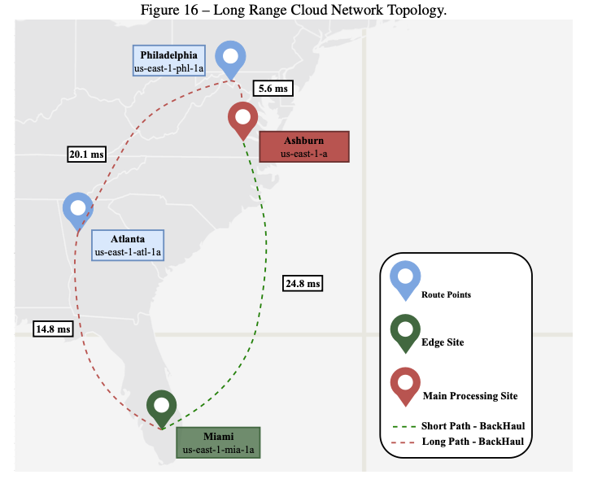
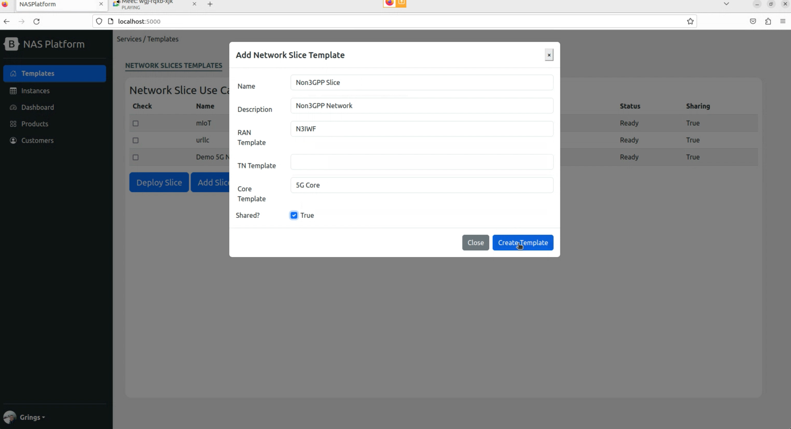

> Main information results and proposed solution are not described here until the submission in the Conference

# NASP - NETWORK SLICE AS A SERVICE PLATFORM FOR NEW-GENERATION NETWORKS BEYOND 5G

An Applied Computing  master's dissertation repository developed by Felipe Grings.

Link to Master's defense: https://youtu.be/m2SN5c9PoEo

Master's thesis: (Not available yet)


## Abstract

The 5th generation of mobile telecommunications (5G) is rapidly adopted worldwide, ac- celerating the demands for highly flexible private networks. In this context, 5G has mobile net- work slicing as one of its main features, where the 3rd Generation Partnership Project (3GPP) defines three main use cases: massive Internet of Things (mIoT), enhanced Mobile BroadBand (eMBB), and Ultra Reliable Low Latency Communications (URLLC), along with their man- agement functions. Moreover, the European Telecommunications Standards Institute (ETSI) defines standards for Zero-touch network & Service Management (ZSM) without human inter- vention. However, the technical documents of these institutes fail to define End-to-End (E2E) management and integration among different domains and subnet instances. This work presents a network slice as a service platform (NASP) agnostically to 3GPP and non-3GPP networks. A NASP architecture is based on the main components, namely: (i) onboard requests for new slices at the business level, fulfilling the translation for definitions of physical instances, distri- butions, and interfaces among domains; (ii) hierarchy orchestrator working among management functions; and (iii) communication interfaces with network controllers. These configurations are based on the technical documents of entities such as 3GPP, ETSI, and O-RAN, following the study of overlapping designs and gaps among the different views. The NASP prototype was developed based on the proposed architecture, bringing implementations and solutions for an agnostic platform and provider of an end-to-end Network Slice as a Service. The tests were analyzed using two use cases (3GPP and Non-3GPP) with four different scenarios, i.e., mIoT, URLLC, 3GPP Shared, and Non-3GPP. The results pointed out the platform’s adaptabil- ity in serving different requests received by the Communication Service Management Function. Moreover, the evaluation showed the time to create a Network Slice Instance, where 68% is dedicated to the Core configuration. The tests also presented a 93% reduction in data session establishment time comparing the URLLC and Shared scenarios. Finally, the study presents the cost variation for operating the platform with the orchestration of 5 and 10 slices, presenting a variation of 112% between Edge and Central.


## Architecture

The project presents the architecture for a platform for NSaaS, considering the end-to-end NS, mapping the definitions of international entities and their relationship, and proposing tech- niques to supply the gaps among the technical documents. For this, several technical documents from entities such as 3GPP, ETSI, GSMA, and O-RAN Alliance were analyzed, where the most mature and convergent definitions were merged, forming the main blocks of this project. There- fore, the architecture maps the orchestration and management of a multi-slice network working with slicing as a service using the management definitions found in 3GPP. The main purposes can be defined in five topics: (i) translation of business templates to define instantiated network subslices; (ii) use of a hierarchy of responsibilities for the deployment of slices; (iii) definition of communication interfaces between management functions and control agents; (iv) Appli- cation of CI/CD concept and IaC strategies for integration between management and physical instances, and finally; (v) telemetry and observability flow.


NASP manages three physical and distributed different domains, RAN, Transport, and Core, described by 3GPP and ETSI reference architectures as shown in Figure 4. The NASP architec- ture has four major components: (i) Onboard; (ii) Orchestration; (iii) Quality Assurance Closed Loops; (iv) Interfaces (RN1, TN1, CN1) to integrate with the controller as shown at the top of Figure 4. The NASP architecture describes the integration and components required on an NSaaS platform to onboard, deploy, and control the entire lifecycle of a network slice through all domains from a mobile network. Furthermore, the NASP architecture proposes a communi- cation flow and interfaces to instantiate all infrastructure necessary to establish an E2E slice, as seen in the lower part of Figure 4. The architecture also proposed the responsibilities for each domain and decision level in each closed loop to pursue SLAs set at the onboard process. In this way, the architecture is based on the responsibilities for each domain and at the decision level defined in the integration process. Each macro functionality of the NASP architecture as a service is described in the following.


## NASP Prototype

The NASP prototype uses Open Source tools to control different domains and manage the infrastructure. The work uses Docker and Container Runtime Interface (CRI) as the container run-time for virtualization and containerization, and for container orchestration, we are choos- ing Kubernetes running over Ubuntu 20.04 machines. Moreover, we define to work with Open Network Operating System (ONOS) for SDN infrastructure controlling a Mininet virtual envi- ronment. We also use OpenAir interface Radio Access modules for 3GPP use cases for RAN control, and the Core network runs over the Free5gc project.


Figure 11 shows SMO functions are containerized NVFs running over a Kubernetes con- tainer orchestrator exposing Hypertext Transfer Protocol (HTTP) services over Ingress Con- troller and Load Balancer provided by Kubernetes. Core NSSMF function interface with Core controller will use Kube-API-server API provided by Kubernetes over HTTP Representational State Transfer (REST) API. Kubernetes is a complete REST Service-based Architecture, so once authentication keys are changed, all infrastructure management is available in an M2M communication. Transport NSSMF function interface with WAN SDN Controller is projected to use ONOS REST API provided by the ONOS project controlling a Mininet virtualized in- frastructure. The API contains manipulation interfaces for devices, network topology, hosts, groups, components, and applications, where once the infrastructure is deployed, NASP throw ONOS can request intents depending on Slice requirements. Finally, RAN NSSMF interfaces with Kube-API-server and My5G-RANTester. Templates, instance descriptions, and Infrastruc- ture codes are designed to be stored as documents in a document-oriented database, in this case, MongoDB. Infrastructure codes are using Helm manifests as a majority. Sometimes, the use of Helm cannot be stored as a manifest. In that case, raw YAMLs were projected to be used as infrastructure descriptors. Tiers distinguish templates and Instance descriptions as tags on document descriptions. For monitoring, alerting, and observability, the project was based on Prometheus as a metric collector, Istio as traffic tracing, and Grafana to expose all the data and configure alerting webhooks.

## Network Topology



## Study Case - O-RAN

The NG-RAN simulation initially is integrated with the My5G-RANTester, on the entire RAN disaggregation protocol stack. First, however, nodes must be available for instantiation and able to request at the RAN Controller interface. Next, the node is virtualized in a container for the prototype to orchestrate Kubernetes. Therefore, according to the characteristics of Ku- bernetes, initially, the multi-tasking infrastructure or O-Cloud (from the O-RAN architecture) is developed in the cluster format and subdivided into three distinct computational resources (CRs). Finally, the Kubernetes platform validates the prototype once the orchestrator is cus- tomized within the scaling function and the multi-tasking infrastructure’s global vision


## Results

#### Slice Deployment Time for Different Scenarios


#### Slice Deployment Steps Time


#### UE Connection Time for Different Scenarios


#### Latency of the Reconfiguration Process


#### Trends in RAM and CPU Usage Over Time


# How to Install

This repository descries steps for innstalling the infrastructure and elements require to make up 6G Network Slice Platform (K8s Infrastructure + 5G Core + N3IWF + UEs Testers + NASP). The instalation process involves X diferrent major steps (Kubernetes Infrastructure + NASP + Run UEs). This project requires at least 2 linux machines.

Kubernetes Infrastructure:
2x
* SO: Ubuntu 22.04 (LTS) x64
* Uname -r >= 5.4.0-122-generic
* Memory: +8GB RAM
* Disk: 80GB

The steps described in this repository were performed based on a network topology similar to the one shown in the figure below:


## 6G Network Slice Components Installation
The installaltion step for each component are described below. Attention: All installation steps deescribed bellow should be executed with root privileges(SUDO SU).

----


### 1 - Kubernetes Infrastructure
**For Each Machine**
Get acces to any Ubuntu 22.04, with specified resources, and prepare the enviroment to the Platform installation

Install dwarves make and gcc
```bash
sudo apt install -y dwarves make gcc curl
```

Copy modules to BPF linux kernel
```bash
cp /sys/kernel/btf/vmlinux /usr/lib/modules/`uname -r`/build/
```

Get GTP5G
```bash
git clone -b v0.8.2 https://github.com/free5gc/gtp5g.git 
cd gtp5g && make clean && make && make install
```

**For Kubernetes Master Machine (ETCD Installed)**

Get acces to any Ubuntu 22.04, with specified resources, that you want to be a Cluster Master (etcd installed).
Access via terminal the machine where the 5GC will be executed and Run:

Install python3-pip annd python3-venv

```bash
apt install -y python3-pip python3-venv
```

Get Kubespray github:
```bash
git clone https://github.com/kubernetes-sigs/kubespray.git
```

Generate RSA KEY and paste to each **.authozired_keys** file in each machine
```bash
ssh-keygen -t rsa -C "$HOSTNAME" -f "$HOME/.ssh/id_rsa" -P ""
cat ~/.ssh/id_rsa.pub >> ~/.ssh/authorized_keys

cat ~/.ssh/id_rsa.pub
```

Prepare Kubespray packages
```bash
VENVDIR=kubespray-venv
KUBESPRAYDIR=kubespray
python3 -m venv $VENVDIR
source $VENVDIR/bin/activate
cd $KUBESPRAYDIR
pip install -U -r requirements.txt
```

Create Kubespray Inventory
```bash
cp -rfp inventory/sample inventory/mycluster
```

Declare Cluster IPS. **ATTENTION. Space separated**
```bash
declare -a IPS=(IP_1 IP_2 IP_3)
# should look like
# declare -a IPS=(10.116.0.3 10.116.0.2)
```

Create Inventory Configs 
```bash
CONFIG_FILE=inventory/mycluster/hosts.yaml python3 contrib/inventory_builder/inventory.py ${IPS[@]}
```

Enable Multus:
```bash
sed -e 's/kube_network_plugin_multus: false/kube_network_plugin_multus: true/' -i roles/kubespray-defaults/defaults/main.yaml  ; grep plugin_multus roles/kubespray-defaults/defaults/main.yaml
```

Enable IP Forward
```bash
sed -e 's/calico_allow_ip_forwarding: false/calico_allow_ip_forwarding: true/' -i roles/network_plugin/calico/defaults/main.yml ; grep forw roles/network_plugin/calico/defaults/main.yml
```

**RUN ANSIBLE***
```bash
ansible-playbook -i inventory/mycluster/hosts.yaml  --become --become-user=root cluster.yml
```

The Excepted output should be like this:


Install Kubectl
```bash
curl -fsSL https://packages.cloud.google.com/apt/doc/apt-key.gpg | sudo gpg --dearmor -o /etc/apt/keyrings/kubernetes-archive-keyring.gpg

echo "deb [signed-by=/etc/apt/keyrings/kubernetes-archive-keyring.gpg] https://apt.kubernetes.io/ kubernetes-xenial main" | sudo tee /etc/apt/sources.list.d/kubernetes.list

sudo apt update

sudo apt install kubectl
```

Connect to any machine and execute
```bash
kubectl get nodes
```

And the output should be like this::


----


## 2 - Observability on K8s components installation

Access via terminal a machine who has access to Kubernetes Cluster CTL. 
Check Kubernetes version:

```
sudo kubectl --version
```

Install HELM
```bash
curl -fsSL https://raw.githubusercontent.com/helm/helm/master/scripts/get-helm-3 | bash
````

Create Monitoring Namespace
```bash
kubectl create namespace monitoring
```


Install Observability Helm Charts:
Install Prometheus
```
helm install prometheus prometheus-community/kube-prometheus-stack -n monitoring
```

Install Grafana
```
helm repo add grafana https://grafana.github.io/helm-charts
helm create ns grafana
helm install grafana -n monitoring
kubectl expose service grafana --port=3000 --type=NodePort --target-port=3000 --name=grafana-exposed
```
Configure Prometheus Data Sorce

Add Network Dashboard to Grafana
```
https://grafana.com/grafana/dashboards/12125-kubernetes-networking-namespace-pods/
```

Install Loki:

```
helm repo add loki https://grafana.github.io/helm-charts
helm create ns loki
helm install loki -n monitoring
```

Install Linkerd:

```
# To add the repo for Linkerd stable releases:
helm repo add linkerd https://helm.linkerd.io/stable

# To add the repo for Linkerd edge releases:
helm repo add linkerd-edge https://helm.linkerd.io/edge

helm install linkerd-crds linkerd/linkerd-crds \
  -n linkerd --create-namespace
  
helm install linkerd-control-plane \
  -n linkerd \
  --set-file identityTrustAnchorsPEM=ca.crt \
  --set-file identity.issuer.tls.crtPEM=issuer.crt \
  --set-file identity.issuer.tls.keyPEM=issuer.key \
  linkerd/linkerd-control-plane
```


### 2 - Install NASP and connect to Kubernetes

In our local machine install python3, pip and poetry:

```
sudo apt install -y python3 python3-pip poetry
```

Clone this repository:

```
git clone https://github.com/fhgrings/NASP.git
```

Access NASP Python application:

```
cd NASP/nasp
```

Install and Update python packages:

```
poetry install --all
```

Run the following command to execute NASP Application with poetry environment:

```
poetry run flask run --debug
```

Copy .kube/config file from one of the kubernetes Machines and paste on 
```bash
./NASP/config/kubeconfig
```

**Then, access it from your browser:**

http://localhost:5000/nasp

#### 2º Load Data to the application

Download the example infrastructure require from the repository:

https://github.com/fhgrings/NASP/tree/main/helm_charts

Open the main *values.yaml* on Helm repo root directory

Update input values from required on infrastructure choosen and save the file:

```yaml
global:
  name: free5gc
  userPlaneArchitecture: single  # possible values are "single" and "ulcl"
  nrf:
    service:
      name: nrf-nnrf
      type: ClusterIP
      port: "8000"
      nodePort: "30800"
    nodeSelector:
  sbi:
    scheme: http
  amf:
    service:
      name: amf-n2
      port: 38412
      targetport: 31412
      protocol: SCTP
      type: NodePort
      n2:
```

Compress the entire folder

Upload the ZIP file to http://localhost:5000/nsst using the **Add Subnet Slice Template** button:


To run the UE copy the file from 
https://github.com/fhgrings/NASP/tree/main/helm_charts/rantester

Compress and import on NSST tab.


To Deploy it Create an NST using Free5GC as Core and RAN_Tester as RAN and UE.
After create, press Deploy NST.



After a few seconds the slice will appear as an instance on Instances Tab


### Test Slice and UE

To check where UE is located use the command
```bash
kubectl get pods -A -o wide | grep -e rantester -e NAME
````
 It should return something like:


To connect to the UE and run the network load tests use:
```bash
kubectl exec -it ran-rantester-0 -n {GIVEN_NAMESPACE} -- bash
```

After connected run
```bash
ping -I uetun1 www.google.com
````


The Dashboard Tabs should start to show the metrics data related to the instance


# Troubleshootinng


## GTP5G
```
Skipping BTF generation for /root/gtp5g/gtp5g.ko due to unavailability of vmlinux
```
https://askubuntu.com/questions/1348250/skipping-btf-generation-xxx-due-to-unavailability-of-vmlinux-on-ubuntu-21-04

---
````
/tools/bpf/resolve_btfids/resolve_btfids: not found
````

You should be using Ubuntu 20.04+. Debian distros do not work properly with Free5gc GTP5G

---

## Kubernetes

AMF Logs 
````
Protocol Not Supported
````

Double Check SMTP properties in your CNI configs

---
````
XMFR Operation not permitted
````
N3IWF Container is not runnning with Privileged permissions.
Double check security Properties in Pod definition
Double check Container Runtime Permissions 

### 5GC

#### Network Functions Conflict 

The 5GC network functions are initialized through a `` ./run.sh ``. If, eventually, the connection with the terminal that initialized the .sh is closed improperly, the functions will continue running as loose processes on the execution stack. When trying to initialize the 5GC again, errors related to connection ports that are already in use will be triggered.
To solve the problem, just run `` ./force_kill.sh ``, is located in the same directory as the ``run.sh`` script. When executing  `` ./force_kill.sh `` all active processes related to the execution of the 5GC functions will be terminated and a new execution can be performed.

#### Conflict in the execution of 5GC API server

For a UE to be able to use the 5GC functionalities, it must be duly registered in the database. This record is performed through a [Rest API](https://github.com/LABORA-INF-UFG/Proto6G-Install#initializing-the-5gc-api-server) provided by the 5GC.
If eventually the terminal used to initialize the API is closed improperly, port 5000 will remain in use, preventing a new execution. In this case, the process must be terminated using kill -9 as described below:

* Find the PID of the process that is using port 50000: ``sudo netstat -nlp | grep :5000``
* Kill the process through the PID:: ``kill -9 <<PID-Nº>>``

#### Data inconsistency in 5GC MongoDB

In experimental scenarios, where the UE-non3GPP + 5GC connection procedures are repeated several times, it may happen that MongoDB persists inconsistent information. In these cases, it is interesting to delete the database and register the UEs again. To resolve the issue, perform the following steps:

* Terminate the execution of UE-non3GPP, N3IWF and 5GC.
* Access through a new terminal on the machine where 5GC was installed.
* Type in terminal `` mongo ``  to connect MongoDB CLI.
* In MongoDB CLI type `` use free5gc `` to connect to free5gc base.
* Type `` db.dropDatabase() `` to completely delete the 5gc database.

After deleting the database, [initialize 5GC](https://github.com/LABORA-INF-UFG/Proto6G-Install#initializing-the-5gc-functions), [initialize API Server](https://github.com/LABORA-INF-UFG/Proto6G-Install#initializing-the-5gc-api-server), [initialize N3IWF](https://github.com/LABORA-INF-UFG/Proto6G-Install#start-n3iwf), [register UE-non3GPP](https://github.com/LABORA-INF-UFG/Proto6G-Install#register-ue-non3gpp-into-5gc) and [test Proto6G components](https://github.com/LABORA-INF-UFG/Proto6G-Install#testing-proto6g-components).
